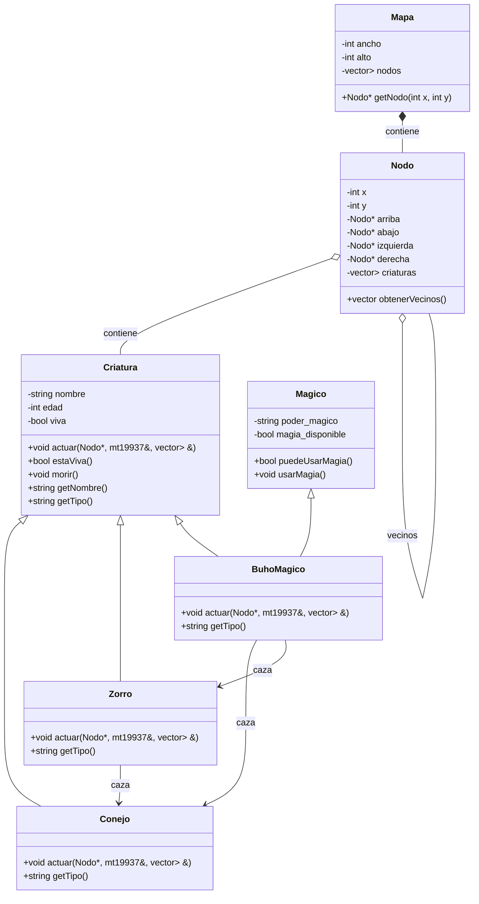

```mermaid
classDiagram

class Criatura {
    -string nombre
    -int edad
    -bool viva
    +void actuar(Nodo*, mt19937&, vector<shared_ptr<Criatura>> &)
    +bool estaViva()
    +void morir()
    +string getNombre()
    +string getTipo()
}

class Conejo {
    +void actuar(Nodo*, mt19937&, vector<shared_ptr<Criatura>> &)
    +string getTipo()
}

class Zorro {
    +void actuar(Nodo*, mt19937&, vector<shared_ptr<Criatura>> &)
    +string getTipo()
}

class Magico {
    -string poder_magico
    -bool magia_disponible
    +bool puedeUsarMagia()
    +void usarMagia()
}

class BuhoMagico {
    +void actuar(Nodo*, mt19937&, vector<shared_ptr<Criatura>> &)
    +string getTipo()
}

class Nodo {
    -int x
    -int y
    -Nodo* arriba
    -Nodo* abajo
    -Nodo* izquierda
    -Nodo* derecha
    -vector<shared_ptr<Criatura>> criaturas
    +vector<Nodo*> obtenerVecinos()
}

class Mapa {
    -int ancho
    -int alto
    -vector<vector<Nodo>> nodos
    +Nodo* getNodo(int x, int y)
}

Criatura <|-- Conejo
Criatura <|-- Zorro
Criatura <|-- BuhoMagico
Magico <|-- BuhoMagico

Nodo o-- Criatura : contiene
Nodo o-- Nodo : vecinos
Mapa *-- Nodo : contiene

Zorro --> Conejo : caza
BuhoMagico --> Conejo : caza
BuhoMagico --> Zorro : caza

```
